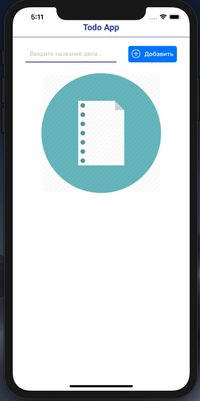
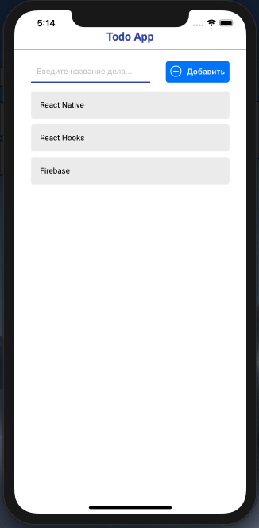
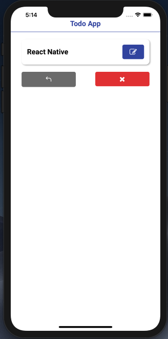
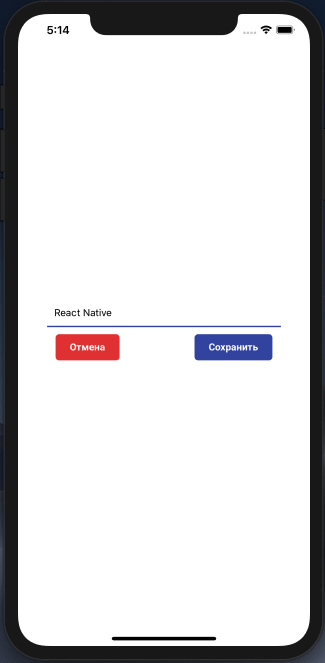
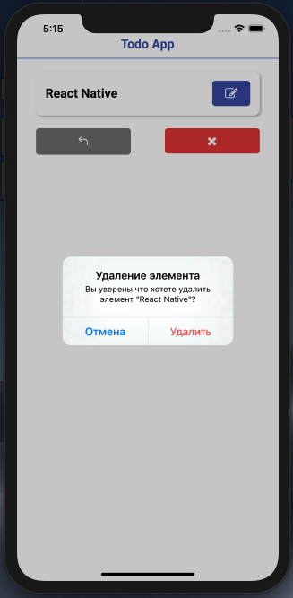

This application was bootstrapped with [React Native](https://facebook.github.io/react-native/).
# Project ``Todo``
Additionally used:
* [React Native](https://facebook.github.io/react-native/).
* [Expo](https://expo.io)
* [React Hooks](https://reactjs.org/docs/hooks-state.html#whats-a-hook)
* [Firebase](https://firebase.google.com) 

## Installation
To start the application, first clone the repository: 
```bash
https://github.com/NikitaPetrovskiy/Project_Todo_using_React-Native.git
```
Install all the dependencies: 
```bash
npm install
```
## Application launch
To start, enter:
```bash
expo start
```
And open ``Expo Client`` on your device. Scan the QR code with Expo Client (``Android``) or Camera (``iOS``). <br>
You may have to wait a minute while your project bundles and loads for the first time.

## Screenshots







## Author
 **[Nikita Petrovskiy](https://www.linkedin.com/in/nikpetrovskiy/)**
